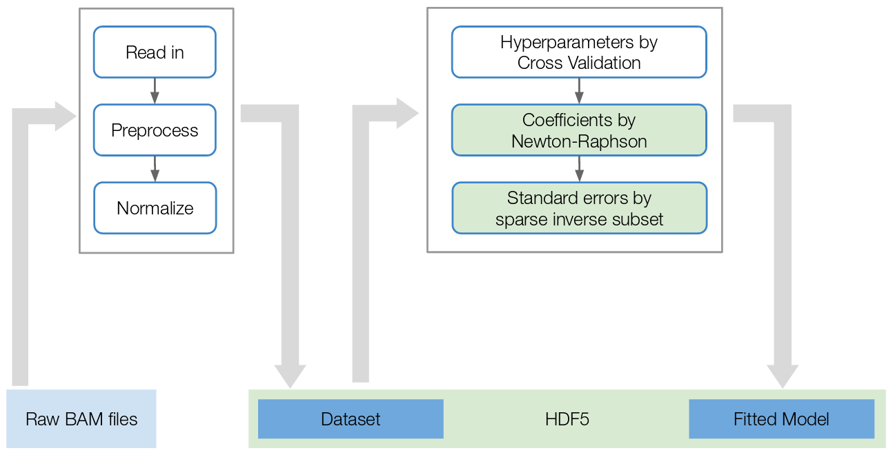

---
  title: "Modeling ChIP-Seq data with GenoGAM2: A Genome-wide generalized additive model"
  shorttitle: "GenoGAM2"
  author: 
  - name: Georg Stricker
	affiliation: &id Technical University Munich
	email: georg.stricker@gmx.net
  - name: Julien Gagneur
	affiliation: *id
	email: gagneur@in.tum.de
  date: "`r format(Sys.Date(), '%m/%d/%Y')`"
  package: GenoGAM2
  abstract: >
	Many genomic assays lead to noisy observations of a biological quantity of 
	interest varying along the genome. This is the case for ChIP-Seq, for which
	read counts reflect local protein occupancy of the ChIP-ed protein. 
	The GenoGAM2 package allows statistical analysis of genome-wide data with 
	smooth functions using generalized additive models. 
	<!-- It provides methods for -->
	<!-- the statistical analysis of ChIP-Seq data including inference of protein  -->
	<!-- occupancy, and pointwise and region-wise differential analysis as well as  -->
	<!-- peak calling with position-wise confidence bands. Estimation of dispersion  -->
	<!-- and smoothing parameters is performed by cross-validation. Scaling of  -->
	<!-- generalized additive model fitting to whole chromosomes is achieved by  -->
	<!-- parallelization over overlapping genomic intervals.  -->
	This vignette explains
	the use of the package for typical ChIP-Seq analysis workflow.
  output: 
    BiocStyle::html_document:
		toc_float: true
  bibliography: bibliog.bib
  vignette: >
    %\VignetteIndexEntry{Vignette Title}
    %\VignetteEngine{knitr::rmarkdown}
    %\VignetteEncoding{UTF-8}  
 ---

```{r setup, echo=FALSE, results="hide"}
knitr::opts_chunk$set(tidy=FALSE, cache=TRUE,
                      dev="png",
                      message=FALSE, error=FALSE, warning=TRUE)
```

GenoGAM version: packageVersion("GenoGAM")

**Note:** if you use GenoGAM2 in published research, please cite:

> Stricker and Engelhardt, et al. (2017)
> GenoGAM: Genome-wide generalized additive models for ChIP-seq analysis
> *Bioinformatics*, **33**:15.
> [10.1093/bioinformatics/btx150](https://doi.org/10.1093/bioinformatics/btx150)

# TL;DR


## Quick start

<!--  -->

\textbf{GenoGAM version:} \Sexpr{packageVersion("GenoGAM")}

\vspace{1em}

\begin{center}
\begin{tabular}{ | l | }
\hline 
If you use \genogam{} in published research, please cite:  \\
\\
Stricker and Engelhardt, \emph{et al.}
\textbf{GenoGAM: Genome-wide generalized additive models for ChIP-seq analysis} \\
\emph{Bioinformatics}\\
\hline 
\end{tabular}
\end{center}

\end{abstract}

<<options, results="hide", echo=FALSE>>=
options(digits=3, width=80, prompt=" ", continue=" ")
opts_chunk$set(dev = 'pdf')
@

\newpage

\tableofcontents

\newpage

\section{TL;DR analysis}

This is the brief version of the usual workflow of \genogam{}. It involves:

\begin{itemize}
  
\item Reading in data through \Rfunction{GenoGAMDataSet} to get a \Robject{GenoGAMDataSet} object
  
\item Computing size factors with \Rfunction{computeSizeFactors}
  
\item Compute model with \Rfunction{genogam} to get the result \Robject{GenoGAM} object

\end{itemize}

<<workflow>>=
library(fastGenoGAM)

## specify folder and experiment design path
folder <- system.file("extdata/Set1", package='GenoGAM')
expDesign <- file.path(folder, "experimentDesign.txt")

## specify chunk and overhang size, bpk being the knot spacing
bpk <- 20
chunkSize <- 1000
overhangSize <- 15*bpk

## build the GenoGAMDataSet
ggd <- GenoGAMDataSet(
  expDesign, directory = folder,
  chunkSize = chunkSize, overhangSize = overhangSize,
  design = ~ s(x) + s(x, by = genotype)
)

ggd

## compute size factors
ggd <- computeSizeFactors(ggd)

ggd

## restrict to the actual small data region (usually not needed, just for vignette purposes)
ggd <- subset(ggd, seqnames == "chrXIV" & pos >= 305000 & pos <= 308000)

ggd

## compute model without parameter estimation to save time in vignette
result <- genogam(ggd, lambda = 4601, theta = 4.51)

result
@ 

\section{Standard \chipseq{} analysis}

\subsection{Goal of the analysis}
A small dataset is provided to illustrate the \chipseq{} functionalities.
This is a subset of the data published by Thornton et al\cite{Thornton2014}, who assayed histone H3 Lysine 4 trimethylation (H3K4me3) by \chipseq{} comparing wild type yeast versus a mutant with a truncated form of Set1, the yeast H3 Lysine 4 methylase. The goal of this analysis is the identification of genomic positions that are significantly differentially methylated in the mutant compared to the wild type strain.

To this end, we will build a \genogam{} model that models the logarithm of the expected ChIP-seq fragment counts $y$ as sums of smooth functions of the genomic position $x$. Specifically, we write (with simplified notations) that:

\begin{equation}
\label{eq:mutantmodel}
\log(\operatorname{E}(y)) = f(x) + \text{genotype} \times f_\text{mutant/wt}(x)
\end{equation}

where genotype is 1 for data from the mutant samples, and 0 for the wild type. Here the function $f(x)$ is the reference level, i.e. the log-rate in the wild type strain. The function $f_\text{mutant/wt}(x)$ is the log-ratio of the mutant over wild-type. We will then statistically test the null hypothesis $f_\text{mutant/wt}(x) = 0$ at each position $x$. In the following we show how to build the dataset, perform the fitting of the model and perform the testing. 

\subsection{Registering a parallel backend}
The parallel backend is registered using the \Biocpkg{BiocParallel} package. See the documentation in \Rclass{BiocParallel} for the correct use. Also note, that \Rclass{BiocParallel} is just an interface to multiple parallel packages. For example in order to use \genogam{} on a cluster, the \CRANpkg{BatchJobs} package might be required. The parallel backend can be registered at anytime as \genogam{} will just call the current one. 

\textbf{IMPORTANT:} According to \href{https://support.bioconductor.org/p/70196/}{this} and \href{https://stat.ethz.ch/pipermail/r-devel/2015-July/071554.html}{this} posts on the Bioconductor support page and R-devel mailing list, the most important core feature of the \emph{multicore} backend, shared memory, is compromised by Rs own garbage collector, resulting in a replication of the entire workspace across all cores. Given that the amount of data in memory is big it might crash the entire system. \textbf{We highly advice to register the SnowParam backend} to avoid this \textbf{if working on a multicore machine}. This way the overhead is a little bigger, but only necessary data is copied to the workers keeping memory consumption relatively low. We never experienced a higher load than 4GB per core, usually it was around 2GB.

On multicore machines by default the number of available cores - 2 are registered
In order to see which parallel backend is currently registered, use the \Rfunction{registered} function. The first entry is the currently registered backend. We can also directly just take the first entry by subsetting:
<<parallel>>=
library(fastGenoGAM)

BiocParallel::registered()[1]
@ 

For this small example we would like to assign less workers and enable a progressbar. Check \Biocpkg{BiocParallel} for other possible backends and more options for \Rfunction{SnowParam}.
Implementing a progressbar in parallel is a little bit tricky and requires the master process to constantly monitor the state of the worker processes. Since this adds to overhead, monitoring does not really happen in real time. So don't expect the progressbar to be precise.
<<parallel-register>>=
BiocParallel::register(BiocParallel::SnowParam(workers = 4, progressbar = TRUE))
@ 

If we check the current registered backend, we see that the number of workers and the backend has changed.
<<check>>=
BiocParallel::registered()[1]
@ 

\subsection{Building a \Rclass{GenoGAMDataSet} dataset}

BAM files restricted to a region of chromosome XIV around the gene \emph{YNL176C} are provided in the \texttt{inst/extdata} folder of the \genogam{} package. This folder also contains a flat file describing the experimental design.

We start by loading the experimental design from the tab-separated text file \texttt{experimentDesign.txt} into a data frame:

<<expdesign>>= 

folder <- system.file("extdata/Set1", package='fastGenoGAM')

expDesign <- read.delim(
  file.path(folder, "experimentDesign.txt")
)

expDesign
@

Each row of the experiment design corresponds to the alignment files in BAM format of one ChIP sample. In case of multiplexed sequencing, the BAM files must have been demultiplexed. The experiment design have named columns. Three column names have a fixed meaning for \genogam{} and must be provided: \Robject{ID}, \Robject{file}, and \Robject{paired}. The field \Robject{ID} stores a unique identifier for each alignment file. It is recommended to use short and easy to understand identifiers because they are subsequently used for labelling data and plots. The field \Robject{file} stores the BAM file name. The field \Robject{paired} values \Robject{TRUE} for  paired-end sequencing data, and \Robject{FALSE} for single-end sequencing data. Further named columns can be added at wish without naming and data type constraints. Here the important one is the \Robject{genotype} column. Note that it is an indicator variable (i.e. valuing 0 or 1). It will allow us modeling the differential occupancy or call peaks later on. 

Four more parameters are required to build a \Robject{GenoGAMDataSet}: 

\begin{itemize}

\item The chunk size in basepairs, i.e. the size of the single region on which the model will be computed. See subsection below for a discussion on the right choice of this parameter.
  
\item The overhang size, i.e. the overlap in basepairs on one side. It will be extended automatically to both sides. See subsection below for a discussion on the right choice of this parameter.
 
\item The design, i.e. the model formula.
  
\item The directory of the BAM files. This is not mandatory, but by default, \genogam{} will assume the data in the working directory path, which is 
  usually not the case

\end{itemize}

\subsubsection{Reading in data from files}

We will now count sequencing fragment centers per genomic position and sample and store these counts into a \Rclass{GenoGAMDataSet}. By default \genogam{}
reduces \chipseq{} data to fragment center counts rather than full base coverage so that each fragment is counted only once. This reduces artificial correlation between adjacent nucleotides. For single-end libraries, the fragment center is estimated by shifting the read end position by a constant (Details in the help on the constructor function \Rfunction{GenoGAMDataSet()}). We choose a knot spacing of 20bp, a chunk size of 1kb and and overhang of 15 knots, i.e 300bp. The \emph{experimentDesign} argument doesn't need to be a \Robject{data.frame}, but can be just the path to the experiment design file. Although the knot spacing won't play a role at this stage, it is already a good idea to define the overhang size in terms of it (see section 'How to choose chunk and overhang size' for more). 
%%Additionally we filter the data for enriched regions only. A threshold is estimated from the data as the median + 3*MAD (Median Absolute Deviation) or can be supplied through the \emph{threshold} argument. Especially on large genomes such as human this can boost the computation time significantly.

<<ggd>>= 

bpk <- 20
chunkSize <- 1000
overhangSize <- 15*bpk

## build the GenoGAMDataSet
ggd <- GenoGAMDataSet(
  experimentDesign = expDesign, directory = folder,
  chunkSize = chunkSize, overhangSize = overhangSize,
  design = ~ s(x) + s(x, by = genotype)
)

ggd
@ 


If not otherwise specified the BAM files are read with respect to the BAM file header. We can see that only one chromosome has been read in, chrXIV. Thus the dimension of the \Robject{GenoGAMDataSet} object states the length of the chromosome (for rows) and the number of columns, i.e. samples. The tiles are of size 1.6kb, which is the sum of the specified chunk size and twice the overhang. However the actual data covered by the BAM file is much smaller, so we reduce the \Robject{GenoGAMDataSet} object. The positions are obviously known by design. See the \emph{Settings} subsection below for methods to specify regions prior to reading.

\subsubsection{Subsetting}

Subsetting works via the \Rfunction{subset} command or by \Robject{GRanges}. The latter works through the \Rfunction{subsetByOverlaps} functions. Thus it can be slower, as it has to determine the overlaps first.

<<subset>>=

## Subsetting by subset command requires to know the column names
rowRanges(ggd)

## Here we know the positions by design of this example
subggd <- subset(ggd, seqnames == "chrXIV" & pos >= 305001 & pos <= 308000)
subggd

## Or subset by GRanges
gr <- GenomicRanges::GRanges("chrXIV", IRanges(305001, 308000))
gr

subggd <- ggd[gr] ## same as subsetByOverlaps(ggd)
subggd
@

\subsubsection{Reading in data from \Rclass{SummarizedExperiment}}

Sometimes data comes in the form of a \Rclass{RangedSummarizedExperiment} or users like to read in the data themselves instead of using the package default. In this case the \Robject{GenoGAMDataSet} object can be built the same way.

<<se-ggd>>= 

## load the SummarizedExperiment object, a new variable "se" appears in the environment
load(file.path(folder, "se.rda"))
se

## build the GenoGAMDataSet from SummarizedExperiment object. 
## Other parameters remain the same
se_ggd <- GenoGAMDataSet(
  experimentDesign = se, chunkSize = chunkSize, 
  overhangSize = overhangSize,
  design = ~ s(x) + s(x, by = genotype)
)

se_ggd
@ 

\subsubsection{The \Rclass{GenoGAMDataSet object}}

A \Rclass{GenoGAMDataSet} stores the count data into a structure that index genomic positions over \textit{tiles}, defined by \Robject{chunkSize} and \Robject{overhangSize}. A bit of background is required to understand these parameters. The smoothing in \genogam{} is based on splines (Figure 1), which are piecewise polynomials. The \textit{knots} are the positions where the polynomials connect. In our experience, one knot every 20 to 50 bp is sufficient for enough resolution of the smooth fits in typical applications. The fitting of generalized additive models involves steps demanding a number of operations proportional to the square of the number of knots, preventing fits along whole chromosomes. To make the fitting of GAMs genome-wide, \genogam{} performs fitting on small overlapping intervals (\textit{tiles}), and join the fit at the midpoint of the overlap of consecutive tiles. The parameters \Robject{chunkSize} and \Robject{overhangSize} defines the tiles, where the chunk is the core part of a tile that does not overlap other tiles, and the overhangs are the two overlapping parts. Overhangs of about 10 times the knot spacing gives reasonable results.

\vspace{1em}

\begin{figure}[!h]
\centering
\includegraphics[width=1\textwidth]{splines}
\caption{An example spline. Displayed are ten cubic B-spline basis functions (of some only tails are seen at the borders) which multiplied by their respective coefficients and summed over at every position make up the complete spline (dark blue). The knots are depicted as dark-grey dots at the bottom-center of each basis function.}
\end{figure}

The \Robject{GenoGAMDataSet} object contains three major objects (the data, the positions and the index) and a couple of useful slots (design, size factors, formula, etc.). As \Rclass{GenoGAMDataSet} is build on top of \Rclass{RangedSummarizedExperiment} most methods work the same way:

<<slots>>=

## The data
assay(subggd)

## The positions
rowRanges(subggd)

## The index
getIndex(subggd)

## experiment design
colData(subggd)

## formula
design(subggd)

## size factors, initially zero
sizeFactors(subggd)

## some important settings
tileSettings(subggd)
@ 

The last command is a list of settings, where each element also has an individual method to be accessed (see ?GenoGAMDataSet). The element \emph{check} tells you if the consistency of the individual objects against each other is checked, e.g. if the chromosomes in the positions object actually comply with the chromosomes in the index object. If this field is FALSE, then some condition got violated and it is not necessarily safe to compute the model anymore.
A more important use of the single elements of the tile settings is the possibility to manipulate them. Note that those settings can never be fully enforced on the data as an exact tiling requires the chunk size to be a multiple of the length of one chromosomes. However chromosomes have different lengths. Thus there will be always differences, especially in the first and last two chunks of a chromosome. However the model does only require equal tile size, which is always guaranteed. On top the chunk size is guaranteed to hold on average.

<<settings manipulation>>=

## the original index
getIndex(subggd)

## change chunk size, new tile size is now 2600
getChunkSize(subggd) <- 2000
getIndex(subggd)

## change tile size, new chunk size is now 1400
getTileSize(subggd) <- 2000
getIndex(subggd)

## change overhang size, chunk size is now equal to tile size
getOverhangSize(subggd) <- 0
getIndex(subggd)

## Note how the overhang size can not be zero between the last two tiles,
## as the chunk size is set to 1400 within a 3kb window. This will
## have an impact in the next call. 
getTileNumber(subggd) <- 1 
## A warnings is issued as the settings indicate a longer total size of the genome.
getIndex(subggd)
@ 

Additionally a number of useful metrics is defined on \Rclass{GenoGAMDataSet} on a a tile basis, e.g. the sum or the mean function.
This also makes it possible to manually filter the regions.

<<metrics>>=

## return tile number to three
getTileNumber(subggd) <- 3

## the sum
sum(subggd)

## or the mean
mean(subggd)

## A simple filter can be done based on this functionality. With the threshold
## being 0.05 reads per bp it results in the same region plus the overhang on
## both sides.
totalMeans <- mean(ggd)
idx <- which(rowMeans(totalMeans) > 0.05)
new_subggd <- subsetByOverlaps(ggd, getIndex(ggd)[idx])
getIndex(new_subggd)
@ 

\subsubsection{How to choose chunk and overhang size}

The chunk size shouldn't be below 1kb, but is otherwise unbound. However the bigger the size the longer it will take to compute the model. On the other hand the less chunks the less parallel processes are needed to compute the entire fit. It should also be noted, that a lower number of chunks results in a lower number of overhangs, which are basically a repeated computation of the same region. Thus the total number of basepairs \emph{involved} in computing the model grows with lower chunk size. Since fitting the entire genome as one chunk is not feasible (hence the parallelization approach) there is a trade-off between number of chunks and chunk size. The default value is set to a reasonable size that gave empirically the best runtime results in practice. However this might be different on other systems. Especially if you have little memory, bigger chunks will result in bigger matrices and thus higher memory consumption.

The overhang size is responsible for smooth connection of adjacent chunks. As the fit is dependent on the number of knots and their positions the overhang size is, too. Thus a sufficient number of knots should be selected and the size in basepairs computed from it by multiplying by the knot spacing. In our experience a sufficiently small relative error can already be achieved with around 5-7 knots. 

\subsubsection{The \Rclass{GenoGAMSettings} class}

The parameters of the basic functionality of the entire \genogam{} pipeline, especially for those steps which involve other R packages, is stored in the \Rclass{GenoGAMSettings} class. The class has six slots:

\begin{itemize}
\item \emph{center}: Set this to FALSE, if you want to count entire fragments instead of only the midpoints.
  
\item \emph{chromosomeList}: If you want to restrict your dataset by chromosome.
  
\item \emph{bamParams}: This is the \Robject{ScanBamParam} object from the \Rpackage{Rsamtools} package. It can be useful to restrict the object to a specific set of regions defined through a \Robject{GRanges} object.
  
\item \emph{processFunction} Define a different process function for raw data. Not really useful for now.
  
\item \emph{optimMethod} One of the methods from the \Rfunction{optim} function. Applies to the cross validation step.
  
\item \emph{optimControl} A list of control parameters for the \Rfunction{optim} function. Important are the two \emph{maxit} elements. The \emph{maxit} element applies to the number of maximal iterations for the cross validation. The \emph{betaMaxit} element applies to the number of maximal iterations for the beta parameter estimation. Especially with varying chunk sizes (and thus varying number of betas) one might consider modifying the latter.

\end{itemize}

A couple of examples on how to use the parameters.

<<settings>>=

## change chromosome list
settings <- GenoGAMSettings(chromosomeList = c("chrI", "chrII"))

## This will print out an error from the internal check function. 
## But still create an empty object. 
temp <- GenoGAMDataSet(
    experimentDesign = expDesign, directory = folder,
    chunkSize = chunkSize, overhangSize = overhangSize,
    design = ~ s(x) + s(x, by = genotype), settings = settings)
temp

## specify parameters through ScanBamParam 
gr <- GRanges("chrXIV", IRanges(305001, 308000))
params <- ScanBamParam(which = gr)
settings <- GenoGAMSettings(bamParams = params)

## read in only the single region we know has counts. No post-subsetting required
temp <- GenoGAMDataSet(
    experimentDesign = expDesign, directory = folder,
    chunkSize = chunkSize, overhangSize = overhangSize,
    design = ~ s(x) + s(x, by = genotype), settings = settings)
temp

## Count entire fragments
slot(settings, "center") <- FALSE

temp <- GenoGAMDataSet(
    experimentDesign = expDesign, directory = folder,
    chunkSize = chunkSize, overhangSize = overhangSize,
    design = ~ s(x) + s(x, by = genotype), settings = settings)

## no zero counts anymore due to high fragment coverage
assay(temp)
@ 

\subsubsection{Modeling with smooth functions: the \Robject{design} parameters}
\genogam{} models the logarithm of the rate of the count data as sums of smooth functions of the genomic position, denoted \Robject{x}. The \Robject{design} parameter is an R formula which allows encoding how the smooth functions depend on the experimental design. \genogam follows formula convention of the R package \Rpackage{mgcv}. A smooth function is denoted \Robject{s()}. For now, \genogam{} only supports smooth function that are cubic splines of the genomic position \Robject{x}. The \Robject{by} variable allows selecting to which samples the smooth contributes to.  \genogam{} only allows \Robject{by} variables to be of value 0 or 1 (hence binary dummy encoding). Here by setting \Robject{'s(x, by=genotype)'} we encode the term "$ \text{genotype} \times f_\text{mutant/wt}(x)$" in Equation ~\ref{eq:mutantmodel}. 

 \textbf{Note:} As for other generalized additive models packages (\Rpackage{mgcv}, \Rpackage{gam}), \genogam{} use the natural logarithm as link function. This is different than other packages of the bioinformatics files such as \Rpackage{DESeq2} which works in base 2 logarithm. 

 
\subsection{Size factor estimation}
Sequencing libraries typically vary in sequencing depth. Such variations is controlled for in \genogam{} by adding a sample-specific constant to the right term of Equation ~\ref{eq:mutantmodel}. The estimation of these constants is performed by the function computeSizeFactor() as follows:

<<sizeFactor>>= 
subggd <- computeSizeFactors(subggd)
sizeFactors(subggd)
@

\textbf{Note:} The size factors in \genogam{} are in the natural logarithm scale. Also factor groups are not identified automatically from the design, but are rather left to the user. By default all samples are treated as members of one factor group and thus size factors are computed together. If custom groups are required, it can be provided separatelly through the \emph{factorGroups} argument. 

<<sf_groups>>=
## clear size factors
sizeFactors(subggd) <- rep(0, dim(subggd)[2])
sizeFactors(subggd)

## compute new with factor groups
groups <- list(c("wt_1", "wt_2"), c("mutant_1", "mutant_2"))
subggd <- computeSizeFactors(subggd, factorGroups = groups)
sizeFactors(subggd)
@ 

Note, how the size factors within a group now add up to zero in log space, which is always the case for groups consisting of two elements.

% The additional function \Rfunction{qualityCheck} will perform a simple quality check of the data and plot the results into the folder \emph{qc}, which is created in the working directory if not present. So far it's only applicable to the \Rclass{GenoGAMDataSet} object and creates two plots: One showing the distribution of counts over all tiles and the second showing multiple scatterplots of the counts from different samples against each other before and after size factor normalization

% <<qualityCheck, eval=FALSE>>=
% ## the function is not run as it creates new plots each time, 
% ## which are not very meaningful for such a small example
% qualityCheck(ggd)
% @ 

\subsection{Model fitting}
\subsubsection{The \Rfunction{genogam} function}
A \genogam{} model requires two further parameters to be fitted: the regularization parameter, $\lambda$, and the dispersion parameter $\theta$. The regularization parameters $\lambda$ controls the amount of smoothing. The larger $\lambda$ is, the smoother the smooth functions are. The dispersion parameter $\theta$ controls how much the observed counts deviate from their expected value modeled by Equation ~\ref{eq:mutantmodel}. The dispersion captures biological and technical variation which one typically sees across replicate samples, but also errors of the model. In \genogam{}, the dispersion is modeled by assuming the counts to follow a negative binomial distribution with mean $\mu=\operatorname{E}(y)$ whose logarithm is modeled by Equation ~\ref{eq:mutantmodel} and with variance $v = \mu + \mu^2/\theta$.  

If not provided, the parameters $\lambda$ and $\theta$ are obtained by cross-validation. This step is a bit time-consuming as it is non-linearly dependent on the data size. That is, the total time for parameter estimation varies much less than the time for model fitting, as the number of regions needed for cross-validation is rather low and at most twenty. Whereas the number of regions for the total model is only bound by genome size. Thus, for sake of going through this example quickly, we provide the values manually. Also we supply the knot spacing at this stage. If it differs from the one used to compute the overhang size, one might end up with too little knots for a sufficient overlap at the junction point of adjacent chunks.

<<fitwocv>>= 

## fit model without parameters estimation
fit <- genogam(subggd, lambda = 4601, theta = 4.51, bpknots = bpk)
fit
@


\textbf{Remark on parameter estimation:} To estimate the parameters $\lambda$ and $\theta$ by cross-validation, call \Rfunction{genogam()} without setting their values. This will perform 10 fold cross-validation on each tile with initial parameter values and iterate until convergence, often for about 50 iterations. Doing it for a default of 20 different regions (which is the same as tiles in this case). Here, for a tile size of 1.6kb this means that estimation of the parameters will require the equivalent of a \genogam{} fit with fixed $\lambda$ and $\theta$ on 16 Mb (1.6kb x10x20x50). For a genome like yeast (12Mb) the cross-validation thus would take more time than a genome-wide fit. In order to avoid this the number of regions is lowered, such that on average cross-validation does not take longer than model fitting. In practice it this will never be triggered unless for small organisms, where even a lower number of regions would be sufficient.

<<fitwithcv, eval=FALSE>>=
fit_CV <- genogam(subggd, bpknots = bpk)
@


\textbf{Remark on parallel computing:}
\genogam{} run parallel computations on multicore architecture (using the \Rpackage{BiocParallel} package). Computing time reduces almost linearly with the number of cores of the machine.

\subsubsection{Fitting in case of sparse data}

A common problem, especially for larger organisms, is the sparsity of data due to low sequencing depth. If one would attempt to compute a genogam{} model fit on a large enough region with zero counts, the model would produce artifacts. An easy workaround was suggested by Wood et. al \cite{wood2006generalized}: Adding the identity matrix multiplied by a small enough $\epsilon$ to the penalization matrix in order to penalize the absolute counts. If $\epsilon$ is small enough it should shrink zero count regions to zero, while having little effect on the other regions. Hence getting rid of the artifacts and stabilizing the fitting process. In order to make use of this in \Rfunction{genogam}, use the \emph{H} parameter, which represents the $epsilon$ value, to pass a small enough value to the penalization matrix. It is zero by default and thus only the second differences are penalized.

<<fitwithH>>=

## a small H shrinks the fit a little bit
fitHsmall <- genogam(subggd, lambda = 4601, theta = 4.51, bpknots = bpk, H = 0.00001)

## compare fit with small H
fits(fitHsmall)
## and fit without H
fits(fit)

## if H is to big, the fit will shrink towards zero
fitH <- genogam(subggd, lambda = 4601, theta = 4.51, bpknots = bpk, H = 0.8)
fits(fitH)
@ 

\subsubsection{The \Rclass{GenoGAM} class}

The results are stored in the \Rclass{GenoGAM} class. This class is build, just like \Rclass{GenoGAMDataSet}, on \Rclass{RangedSummarizedExperiment}. As such all respective methods are applicable, with a few exceptions:

\begin{itemize}
\item \Rfunction{getSettings} now gives access to the settings slot
\item \Rfunction{getFamily} provides access to the distribution used
\item \Rfunction{getParams} provides access to all parameters used during
  computation as well as the tile settings
\item \Rfunction{fits} and \Rfunction{se} return the pointwise fits and standard 
  errors, respectively
\end{itemize}
  
<<gg slots>>=

## the model formula
design(fit)

## the size factors
sizeFactors(fit)

## the global model settings
getSettings(fit)

## the distribution used
getFamily(fit)

## the parameters used in the model and dataset
getParams(fit)

## the assay is actually a list of two elements, the fits and the
## standard errors. But calling just assay returns the fits
assays(fit)
assay(fit)

## separate functions are recommended to be used for access
fits(fit)
se(fit)

## positions
rowRanges(fit)

## subsetting works just like in GenoGAMDataSet
subfit <- subset(fit, pos < 306001)
rowRanges(subfit)

gr <- GRanges("chrXIV", IRanges(306001, 307000))
subfit <- fit[gr]
rowRanges(subfit)
@ 

% \subsection{Plotting results}
% Count data and fits for a region of interest can be extracted using the function \Rfunction{view()}. Following the  \Rpackage{mgcv} and \Rpackage{gam} convention the names of the fit for the smooth function defined by the \Robject{by} variable follow the pattern \Robject{s(x):\{by-variable\}}. Here, the smooth function of interest $f_\text{mutant/wt}(x)$ is thus named \Robject{s(x):genotype}.

% <<view>>=
% # extract count data into a data frame 
% df_data <- view(ggd)
% head(df_data)

% # extract fit into a data frame 
% df_fit <- view(fit)
% head(df_fit)
% @

% If only a subset of the data supposed to be viewed it is best to use a \Rfunction{GRanges} object and supply it to the emph{ranges} argument.
% <<viewranges>>=
% gr <- GRanges("chrXIV", IRanges(306000, 308000))
% head(view(ggd, ranges = gr))
% @ 

% The GenoGAM specific plot function will make use of the ggplot2 framework if available or fall back to base R otherwise. Note, that without any restrictions on positions or chromosomes it will attempt to plot all the data and throw an error if it is too big.

% In the count data, the peak of methylation in the two replicates of the wild type (first two panels) in the region 306,500-307,000 seems attenuated in the two replicates of the mutant (3rd and 4th panel). There are relatively more counts for the mutant in the region 305,500-306,500. The \genogam{} fit of the log-ratio (last panel, confidence band dotted) indicates that that these differences are significant. This redistribution of the methylation mark from the promoter (wild type) into the gene body (mutant) was reported by the authors of the study ~\cite{Thornton2014}. Additionally a smooth for the input is shown (second to last). Both smooths added together give the log-fit of the mutant data (not shown).

% <<plotfit,  fig.width=6.5, fig.height=8>>=
% plot(fit, ggd, scale = FALSE)
% @

% \subsection{Statistical testing}
% We test for each smooth and at each position $x$ the null hypothesis that it values 0 by a call to \Rfunction{computeSignificance()}. This gives us pointwise p-values. 

% <<signif>>=
% fit <- computeSignificance(fit)
% df_fit <- view(fit)
% head(df_fit)
% @

% \subsection{Differential binding}
% If region-wise significance is needed, as in the case of differential binding, then we call \Rfunction{computeRegionSignificance()}. This returns the provided \Robject{GRanges} regions object updated by a p-value and FRD column.

% <<regsignif>>=
% gr
% gr <- computeRegionSignificance(fit, regions = gr, what = 'genotype')
% gr
% @ 

% \subsection{Peak calling}
% The computed fit allows for easy peak calling of narrow and broad peaks via the \Rfunction{callPeaks()}. The resulting \Robject{data.table} provides a similar structure as the ENCODE narrowPeak and broadPeak format. Note, the \emph{score} is given as the negative natural logarithm of the p-values. Also peak borders are different from the usually computed peak borders of other methods. The borders are in fact a 95-\% confidence interval around the peak position. As this is not peak calling data, we use a high threshold do demonstrate the functionality.

% <<peaks>>=
% peaks <- callPeaks(fit, smooth = "genotype", threshold = 1)
% peaks

% peaks <- callPeaks(fit, smooth = "genotype", threshold = 1, 
%                    peakType = "broad", cutoff = 0.75)
% peaks
% @ 

% The function \Rfunction{writeToBEDFile} provides an easy way to write the peaks data.table to a \emph{narrowPeaks} or \emph{broadPeaks} file. The suffix will be determined automatically
% <<bed, eval=FALSE>>=
% writeToBEDFile(peaks, file = 'myPeaks')
% @ 

% \section{Computation statistics}
% At the moment the computation time for genome-wide analysis ranges from a couple of hours on yeast to a 2-3 days on human. The memory usage never exceeded
% 4GByte per core. Usually it was around 2-3 GByte per core. We are also currently implementing an optimized model fitting procedure, that reduces computation time significantly. Unfortunately we were not able to include it into the package for this Bioconductor release, but are confident to be able to do it into the next release. Interested users should therefore check the developer version of \Biocpkg{GenoGAM} for updates.

\section{Acknowledgments}

We thank Alexander Engelhardt, Herv\'e Pag\`es, and Martin Morgan for input in the development of \genogam{}. 

\section{Session Info}

<<sessInfo, results="asis", echo=FALSE>>=
toLatex(sessionInfo())
@

<<resetOptions, results="hide", echo=FALSE>>=
options(prompt="> ", continue="+ ")
@ 

\bibliography{bibliog}

\end{document}
